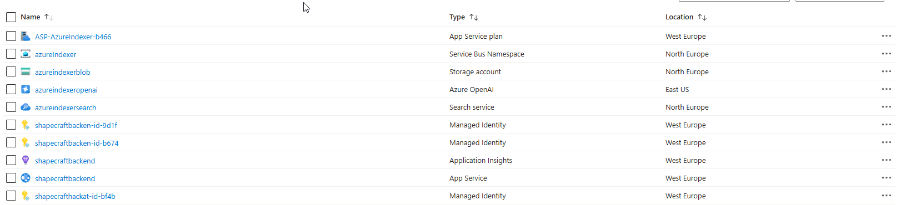

# ShapeCraft AI Chatbot 🤖✨

An **AI-powered chatbot** that fetches and processes NFT-related data from **OpenSea, Transient Labs, and Manifold**, indexes it with **Azure Cognitive Search**, and serves intelligent responses via **Azure OpenAI**.

This project was built during the **ShapeCraft Hackathon** to explore how **AI + blockchain + cloud infrastructure** can be combined into a secure and scalable dApp-like experience.

---

## 🚀 Features

* **Data ingestion pipeline**

  * Fetches data from OpenSea API, Transient Labs, and Manifold
  * Uploads content as blobs to **Azure Blob Storage**
  * Uses **Azure Service Bus Queue** to coordinate processing

* **Data processing & indexing**

  * Consumes queue messages and processes blob data
  * Generates vector embeddings for content
  * Trains an **online AI model** on Azure
  * Stores searchable vectors in **Azure Cognitive Search**
  * Cleans up blobs and queues after processing (efficient + cost-friendly)

* **AI-powered API**

  * Web API layer connected to **Azure OpenAI**
  * **JWT authentication** (user wallet address required)
  * **CORS restricted** to only allow front-end requests
  * Uses **Managed Identities** for secure resource access

* **Front-end chatbot**

  * Lightweight UI built with BuilderKit
  * Clean chat interface for interaction with the AI
  * Planned gamification features with blockchain integration (leaderboards, medals, NFTs, etc.)

* **Smart contract integration (Sepolia testnet, not implemented in the Front-end yet)**

  * [Smart contract deployed](https://sepolia.etherscan.io/address/0x0C47df1636E3f55eE27bfe3D29bcD9831A3e0B93)
  * Users can pay for **100 chatbot requests**
  * Future plans: faucet, gasback method, NFT rewards, leaderboards

---

## 🛠️ Tech Stack

* **Azure Services**

  * Blob Storage
  * Queue Storage
  * Cognitive Search
  * OpenAI Service
  * Managed Identities

* **Blockchain**

  * Sepolia chain smart contract
  * Wallet-based JWT authentication

* **Frontend**

  * BuilderKit-based chatbot UI
  * Hosted on **Vercel**

* **Backend**

  * Azure Web App (.NET8.0 API)
  * JWT-protected endpoints
  * CORS-enabled security

---

## 🔗 Live Demo

* **Frontend (Chatbot UI):** [shapecrafthackathon.vercel.app](https://shapecrafthackathon.vercel.app/)
* **Backend (API, JWT required):** [shapecraftbackend](https://shapecraftbackend-hwfxauccgrcsbgav.westeurope-01.azurewebsites.net/)

---

## 📌 Hackathon Learnings

Things that worked well ✅

* Secure architecture with Azure managed identities
* JWT + CORS shielding for safe API access
* Data ingestion + indexing pipeline completed
* Blockchain contract deployed on Sepolia (not used because of time shortage)

Challenges & improvements 🚧

* Lost \~10 hours on deployment struggles and trying to extend the existing mcp server (apps + MCP server investigation)
* Limited time for frontend polish and gamification features
* Future ideas:

  * Faucet integration to help people get testnet ETH quickly
  * Ensure user payed for the requests
  * NFT rewards + medal system
  * Leaderboard for most active users
  * Advanced UI styling + UX improvements

---

## 📸 Resources & Architecture

Here’s an overview of the Azure resources used:

## 📸 Demo video 

Some parts are cut, otherwise the video would have been 10 min

* 0:00) All the orchestrators fetch the data
* 1:51) Azure AI start processing (training the AI)
* 2:22) **Before training:** 129 documents, 4.56 MB vector indexes, 5MB total storage, **After training:** 170 documents, 6.01MC vector indexes, 11.53MB total storage
* 2:30) Chatbot in action
* 3:40) Ask a not NFT related question he was not trained on

⚠️ **Important Note**  
  
The AI model has currently been trained on a **small subset of data**.  
It can **only answer questions about the content it has been trained on** – it will not provide accurate responses for topics outside of this dataset. (see example: why is grass green?)
  
The training data sources are:  
 - `ManifoldTrainingData.cs` – Manifold content  
 - `TransientLabsTrainingData` – Transient Labs content  
 - `OpenseaOrchestrator` – Defines which OpenSea data is used for training  
  
As the project evolves, the dataset can be expanded to cover more content and provide richer answers.

